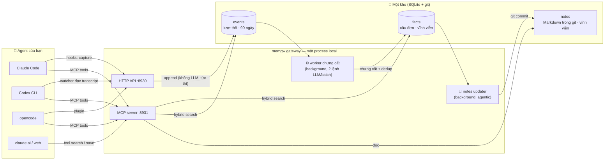
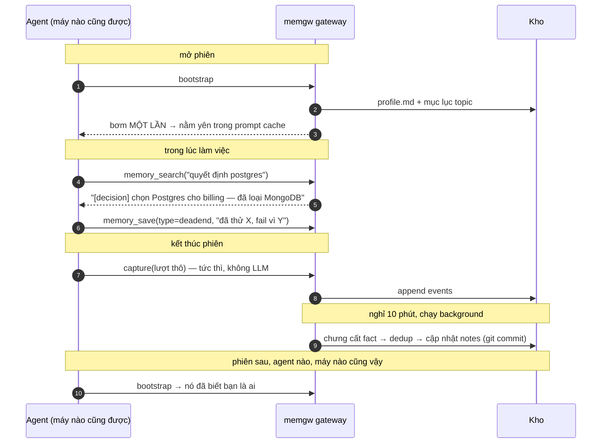

<div align="center">

# 🧠 memgw

**Trí nhớ dài hạn dùng chung cho các AI coding agent.**

Một kho duy nhất mà Claude Code, Codex CLI, opencode và bất cứ thứ gì nói được MCP
đều đọc và ghi vào. Agent của bạn thôi quên bạn sau mỗi phiên.

[](https://github.com/holetexvn/memgw/actions/workflows/ci.yml)
[](package.json)
[](LICENSE)
[](#cài-đặt)
[](docs/06-BENCHMARKS.md)

[English](README.md) · Tiếng Việt

```bash
npx @holetex/memgw setup
```

</div>

Một lệnh: nó tạo `~/.memgw`, sinh key, hỏi key LLM của bạn, nối Claude Code (hooks +
MCP) và Codex (MCP) nếu có trên máy, khởi động gateway, và kết thúc bằng một lượt kiểm
tra sức khỏe. Phần nào chưa tự động được thì nó nói thẳng: supervision qua reboot tự
cài trên macOS (launchd) và Linux (systemd --user) từ bản cài cố định (`npm i -g @holetex/memgw`
hoặc clone), còn Windows / chạy qua npx-cache sẽ được in đúng dòng lệnh Task Scheduler
/ lệnh cài để bạn chạy; opencode nhận một dòng lệnh copy; phần *capture* của Codex là một process
riêng `memgw watch --agent codex`. Thích tự tay từng bước? `npx @holetex/memgw start` chỉ khởi
động gateway và in các lệnh ra.

---

## Vấn đề

Mỗi agent giữ trí nhớ trong ốc đảo riêng của nó. Claude Code trên laptop không biết gì
về phiên bạn chạy trên desktop. Codex không biết gì về cả hai. Đóng terminal là ngữ
cảnh biến mất.

Phần tốn kém nhất trong ngày của bạn không phải là viết code, mà là **giải thích lại
ngữ cảnh**: dự án này là gì, quy ước nào đang áp dụng, chỗ nào không được đụng, và tuần
trước bạn đã thử gì mà thất bại.

memgw giữ tất cả ở một chỗ. Agent nào cũng ghi vào đó, agent nào cũng đọc từ đó.

## Kiến trúc



Ba tầng, tầng sau chưng cất hơn tầng trước:

| Tầng | Là gì | Ai ghi | Sống bao lâu |
|---|---|---|---|
| **events** | lượt hội thoại thô | capture, không tốn LLM | 90 ngày |
| **facts** | câu đơn đã khử trùng lặp | worker, 2 lệnh LLM mỗi batch | vĩnh viễn |
| **notes** | file Markdown theo topic, trong git | worker, vòng lặp agentic | vĩnh viễn |

Capture cố tình rẻ và "ngu": ghi lượt thô rồi trả về ngay, không bao giờ làm chậm
agent. Mọi thứ đắt đỏ diễn ra sau, ở background.

## Một phiên với memgw



Truy xuất theo một nguyên tắc quan trọng: **ngữ cảnh ổn định được bơm một lần lúc mở
phiên** (profile, mục lục topic) để nằm yên trong prompt cache, còn **fact cụ thể được
mở ra dưới dạng tool** cho agent tự gọi khi thật sự cần. Bơm kết quả search vào mỗi
lượt sẽ phá cache và làm ngập ngữ cảnh bằng nhiễu.

Có một loại fact đáng giá hơn hẳn phần còn lại: `deadend` — thứ bạn đã thử, thất bại,
và lý do. Agent rất thích lặp lại đúng sai lầm cũ; đây là thứ chặn điều đó.

## Sao không dùng… ?

| | Lịch sử chat | RAG trên transcript | **memgw** |
|---|---|---|---|
| Sống sót khi đóng terminal | ❌ | ✅ | ✅ |
| Dùng chung giữa các agent khác nhau | ❌ | ❌ mỗi tool một kho | ✅ một kho |
| Đã chưng cất (fact, không phải tường chữ) | ❌ | ❌ chunk thô | ✅ câu đơn |
| Nhớ thứ đã **thất bại** và vì sao | ❌ | ⚠️ chôn vùi | ✅ type `deadend` |
| Thân thiện với prompt cache | ❌ | ❌ bơm mỗi lượt | ✅ bơm một lần + tool |
| Người soát được | ❌ | ❌ index mờ mịt | ✅ `git log -p` trên notes |
| Hạ tầng cần thêm | — | vector DB + pipeline | một file SQLite |

## Tính năng

- 🔌 **Mọi agent nói MCP** — Claude Code, Codex CLI, opencode, claude.ai, Hermes, hay
  bất kỳ CLI nào qua watcher `generic`. Năm MCP tool, một endpoint.
- 🏠 **Local-first** — một process, một file SQLite, bind `127.0.0.1`. Muốn nhiều máy
  chung trí nhớ thì deploy lên VPS bằng một installer.
- 🔍 **Hybrid search** — FTS5/BM25 luôn chạy (không API, không tốn tiền);
  `memgw embed on` thêm vector ngay trong cùng file SQLite, fuse bằng RRF, tự rơi về
  BM25 khi API embeddings chết.
- 🪦 **Trí nhớ ngõ cụt** — fact `type=deadend` chặn agent thử lại thứ đã fail. Loại
  fact đáng giá nhất, và cũng là thứ con người hay quên truyền lại nhất.
- 📓 **Notes có git soát lưng** — mọi thứ model viết ra Markdown đều soi được bằng
  `git log -p` và hoàn tác bằng một lệnh `git revert`.
- 🛡️ **Auth không bao giờ là tùy chọn** — server từ chối chạy khi thiếu key, từ chối
  key yếu khi bind ra ngoài loopback. Không tồn tại cấu hình "kho nhớ mở toang".
- 💸 **$1–3 / tháng** — chi phí bám theo lượng bạn nói chuyện với agent, không bám theo
  độ lớn kho; mọi worker chạy theo cursor. Dùng được mọi endpoint tương thích OpenAI.
- 🌏 **Prompt Anh + Việt** — fact viết ra đúng thứ tiếng bạn làm việc
  (`MEMGW_PROMPT_LANG=vi`). Thêm ngôn ngữ mới chỉ là copy một block.

## Cài đặt

### Local

```bash
npx @holetex/memgw start              # không cần config, bind 127.0.0.1
```

Thêm key LLM khi muốn chưng cất fact thay vì chỉ capture:

```bash
echo 'MEMGW_LLM_API_KEY=sk-...' >> ~/.memgw/env
```

Mọi endpoint tương thích OpenAI đều dùng được: OpenAI, DeepSeek, Groq, OpenRouter, hay
Ollama / vLLM chạy local. Dùng model rẻ — worker chạy cả ngày.

Chưa có key? `npx @holetex/memgw start --mock` chạy toàn bộ pipeline mà không cần key.

### Server

Khi nhiều máy dùng chung một kho, hoặc web client cần HTTPS công khai:

```bash
bash scripts/build-installer.sh          # builds memgw-installer.run from this checkout
scp memgw-installer.run user@vps:/tmp/
ssh user@vps "sudo MEMGW_DOMAIN=memgw.example.com MEMGW_LLM_API_KEY=sk-xxx \
  bash /tmp/memgw-installer.run"
```

Installer lo Node, user riêng, systemd, Caddy + TLS, firewall, và backup Litestream tùy
chọn. Xem [docs/02-OPERATIONS.md](docs/02-OPERATIONS.md).

## Kết nối agent

| Agent | Đọc | Ghi |
|---|---|---|
| **Claude Code** | MCP + hook `SessionStart` | hook `Stop` |
| **Codex CLI** | MCP | watcher đọc transcript |
| **opencode** | MCP | plugin native |
| **claude.ai / web** | MCP connector | agent gọi `memory_save` |
| **Hermes** | `prefetch()` | `sync_turn()` |
| **thứ khác** | MCP, nếu nói được | watcher `generic` |

```bash
npx @holetex/memgw hooks                        # Claude Code: capture + bootstrap
claude mcp add --transport http memgw http://127.0.0.1:8931/mcp \
  --header "Authorization: Bearer $MEMGW_KEY"

codex mcp add memgw --url http://127.0.0.1:8931/mcp/<MEMGW_MCP_SECRET>
npx @holetex/memgw watch --agent codex          # Codex không có hook, nên watch transcript
```

Chi tiết từng client: [docs/03-INTEGRATION.md](docs/03-INTEGRATION.md) và
[docs/05-MULTI-AGENT.md](docs/05-MULTI-AGENT.md).

## MCP tools

Năm tool, mọi agent kết nối đều dùng được:

| Tool | Mục đích |
|---|---|
| `memory_search` | tìm fact đã chưng cất, lọc theo type và topic |
| `conversation_search` | tìm trong transcript thô của mọi agent |
| `memory_read_note` | đọc một topic note hoặc profile |
| `memory_save` | lưu một fact |
| `memory_bootstrap` | profile + mục lục topic |

## CLI

```
memgw start      Khởi động gateway
memgw init       Tạo config mà không khởi động
memgw status     Thống kê kho
memgw doctor     Chẩn đoán cấu hình và kết nối
memgw search     Tìm fact từ terminal
memgw save       Lưu fact từ terminal
memgw forget     Loại bỏ fact (mặc định dry-run)
memgw embed      Bật/tắt semantic search
memgw watch      Theo dõi transcript của agent
memgw hooks      Cài hook cho Claude Code
```

## Lựa chọn thiết kế

**SQLite + FTS5, không vector database.** Full-text search là tầng luôn luôn chạy:
không phụ thuộc API, không tốn tiền. Semantic search cách đúng một lệnh
(`memgw embed on`) và nằm ngay trong cùng file SQLite — vector là BLOB, fuse với BM25,
tự rơi về BM25 khi API embeddings chết. Mặc định tắt.

**Notes là Markdown trong git.** Trí nhớ do model viết là trí nhớ bạn phải soi và sửa
được. `git log -p` cho thấy từng thay đổi worker đã làm, và một lần sửa hỏng chỉ cách
`git revert` một lệnh.

**Auth không bao giờ là tùy chọn.** Server từ chối khởi động khi không có key. Bind ra
ngoài loopback thì đòi key mạnh. Không tồn tại cấu hình nào khiến memgw thành kho nhớ
mở toang.

**Best-effort từ thiết kế.** Mọi lệnh gọi có timeout, mọi lỗi được nuốt và ghi log. Kho
nhớ chết không bao giờ được kéo agent của bạn chết theo.

Lý do đằng sau từng lựa chọn, kể cả những gì đã bị loại và vì sao:
[docs/01-ARCHITECTURE.md](docs/01-ARCHITECTURE.md).

## Độ nhớ đo được

Đo end-to-end trên [LoCoMo](https://github.com/snap-research/locomo) (1.986 câu hỏi đi
qua pipeline thật capture → chưng cất → dedup → search, chấm bằng LLM):

| Retrieval | Tổng thể | Từ chối đúng khi trí nhớ không có đáp án |
|---|---|---|
| BM25 (mặc định) | 58.6% | 84.5% |
| + embeddings (`memgw embed on`) | **66.4%** | 80.3% |

Phương pháp, điểm theo từng loại câu hỏi, và cách tự chạy lại với ~$4:
[docs/06-BENCHMARKS.md](docs/06-BENCHMARKS.md).

## Chi phí

Khoảng 15 phiên mỗi ngày trên tất cả agent, với model rẻ, rơi vào cỡ 60 lệnh LLM và
0.5M token mỗi ngày: **$1–3 một tháng**. Chi phí bám theo lượng bạn nói chuyện với
agent, không bám theo độ lớn của kho, vì mọi worker chạy theo cursor.

## Tài liệu

| Tài liệu | Đọc khi |
|---|---|
| [01-ARCHITECTURE](docs/01-ARCHITECTURE.md) | muốn biết nó chạy thế nào và vì sao |
| [02-OPERATIONS](docs/02-OPERATIONS.md) | deploy, cấu hình, xử lý sự cố, backup |
| [03-INTEGRATION](docs/03-INTEGRATION.md) | kết nối một client cụ thể |
| [04-API](docs/04-API.md) | tra cứu endpoint và MCP tool |
| [05-MULTI-AGENT](docs/05-MULTI-AGENT.md) | thêm Codex, opencode, hay CLI của riêng bạn |
| [06-BENCHMARKS](docs/06-BENCHMARKS.md) | độ nhớ đo trên LoCoMo và cách chạy lại |

## Ngôn ngữ prompt

Prompt chưng cất có sẵn tiếng Anh và tiếng Việt. Fact do model viết ra theo ngôn ngữ
của prompt, nên hãy chọn thứ tiếng bạn thực sự làm việc:

```bash
echo 'MEMGW_PROMPT_LANG=vi' >> ~/.memgw/env
```

Thêm một ngôn ngữ chỉ là copy một block trong `src/prompts.js`. Hoan nghênh đóng góp.

## Phát triển

```bash
git clone https://github.com/holetexvn/memgw.git
cd memgw && npm install
bash test/run-all.sh          # 11 suite, không cần API key; runner tự in tổng số
```

Bộ test có `verify-docs.mjs` — đối chiếu chính tài liệu này với code: endpoint, tên
tool, và các hằng số được trích trong văn. Đổi default mà không cập nhật docs là suite
đỏ.

Xem [CONTRIBUTING.md](CONTRIBUTING.md).

## Nguồn cảm hứng

Cách tiếp cận chưng cất theo tầng và vài chi tiết cài đặt được tham khảo từ
[TencentDB Agent Memory](https://github.com/TencentCloud/TencentDB-Agent-Memory) (MIT).
memgw là phiên bản nhỏ hơn nhiều, một người dùng, của cùng ý tưởng: không quản lý team,
không ACL, không hạ tầng ngoài. `docs/01-ARCHITECTURE.md` có mục so sánh hai bên.

## Giấy phép

MIT

---

<div align="center">

Nếu memgw giúp bạn khỏi phải giải thích lại dự án thêm một lần nữa, hãy ⭐ repo —
để agent của người khác cũng tìm được trí nhớ của họ.

</div>
