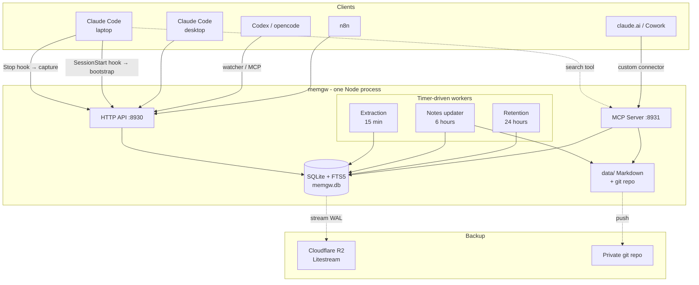
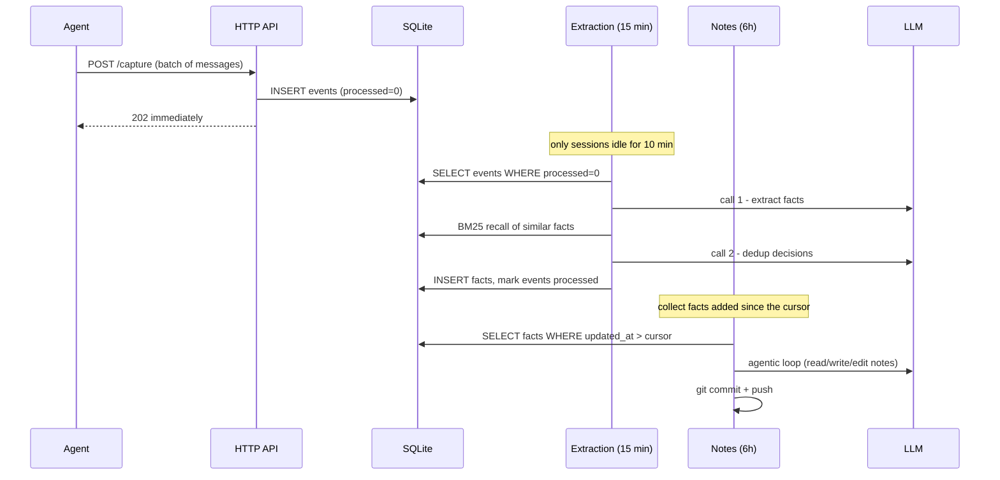

# memgw - Architecture

This document explains how the system works and WHY it is built this way.
If you only want to run it, read `02-OPERATIONS.md`. If you want to connect a client, read `03-INTEGRATION.md`.

---

## 1. The problem

Every agent keeps its memory in its own island:

- Claude Code on your laptop knows nothing about the session on your desktop
- An agent running on a server knows nothing about either
- claude.ai is a third world again
- Close the terminal and the context is gone, so the next session starts from scratch

The most expensive thing in a working day is not writing code, it is **reloading context**:
what this project is, what the conventions are, what not to touch, what was tried last week
and why it broke.

memgw solves that with one central store: every agent writes to the same place, and reads
from the same place.

## 2. Design principles

These six principles drive almost every technical choice below.

**1. Capture must be cheap and dumb.** Write raw, no LLM, no processing, nothing that blocks
the agent. Everything clever happens asynchronously behind it. Slow capture is capture that
gets turned off.

**2. Memory is best-effort, never load-bearing.** If memory dies, the agent keeps working.
Every call has a timeout, every error is swallowed and logged, and there is no path by which
memory can take an agent down with it.

**3. BM25 first, vectors optional.** For a personal store of a few tens of thousands of
records, full-text search is good enough to start, and it is the layer that always works:
no API dependency, no cost. Semantic search is an opt-in on top (`memgw embed on`): vectors
live as BLOBs inside the same SQLite file, fused with BM25 by reciprocal-rank fusion, and
search silently falls back to BM25 whenever the embeddings API is unavailable. Measured
effect in [06-BENCHMARKS](06-BENCHMARKS.md): +7.8 points overall on LoCoMo. There is still
no vector database and no new dependency.

**4. Respect the prompt cache.** Stable content (profile, topic index) is injected once at
session start. Dynamic content (individual facts) is NOT injected every turn; it is exposed
as tools the agent calls when it needs them. This is the most expensive lesson taken from
TencentDB Agent Memory.

**5. Memory must be human-readable and hand-editable.** The top layer is Markdown files in a
git repo, not blobs in a database. When it is wrong you open the file and fix it, or
`git revert`.

**6. Auth on everything that touches data.** Every endpoint that reads or writes memory
requires the auth key; the single deliberate exception is `GET /health`, which exposes only
liveness and the configured model name so that `doctor` and supervisors can probe without a
key. On loopback the key is generated for you on first run, so there is nothing to
configure; binding beyond loopback with a weak or missing key is refused outright.

## 3. System overview



One process. No Redis, no Mongo, no vector database, no message queue.
All state lives in a single SQLite file and a directory of Markdown.

The same process is both the local tool and the server. By default it binds `127.0.0.1`
and keeps everything under `~/.memgw`, so `npx memgw start` needs no configuration at all.
Set `MEMGW_BIND=0.0.0.0` and put it behind TLS when you want to share it across machines.
Only configuration changes; the code does not.

## 4. Three data layers

| Layer | Name | Storage | Produced by | Lifetime |
|---|---|---|---|---|
| 1 | **events** | SQLite rows + FTS5 | capture, no LLM | deleted after 90 days |
| 2 | **facts** | SQLite rows + FTS5 | worker, 2 LLM calls per batch | permanent |
| 3 | **notes** | Markdown in git | worker, agentic loop | permanent |

The higher the layer, the denser it is, the less often it changes, and the more it deserves
to be injected early.

### 4.1 events layer - the raw log

Every conversation turn from every source. Only the real user and assistant text is kept,
with tool calls and harness noise already stripped out (see 6.1).

```sql
CREATE TABLE events (
  id          TEXT PRIMARY KEY,   -- sha1(session|ts|role|content) → idempotent
  source      TEXT NOT NULL,      -- claude-code-laptop | codex | opencode | cowork | n8n
  session_id  TEXT NOT NULL,
  role        TEXT NOT NULL,
  content     TEXT NOT NULL,
  ts          INTEGER NOT NULL,
  processed   INTEGER DEFAULT 0   -- worker cursor
);
```

The deterministic `id` matters: a hook can retry as often as it likes, and resending the
same payload produces no duplicate row. `INSERT OR IGNORE` handles the rest.

### 4.2 facts layer - atomic units of memory

A fact is ONE sentence that stands on its own, understandable with no surrounding context.

```sql
CREATE TABLE facts (
  id, content, type, topic, priority,
  source_ids,   -- json array of the event ids it came from
  version,      -- incremented on every update/merge
  status,       -- 'active' | 'superseded'
  created_at, updated_at
);
```

Six `type` values, each with its own purpose:

| type | Meaning | Example | Priority |
|---|---|---|---|
| `preference` | habits, working style | "uses pnpm, not npm" | 50-80 |
| `decision` | a settled choice | "chose SQLite for memgw" | 60-90 |
| `instruction` | a rule set for the AI | "always write commit messages in English" | 80-100 |
| `project` | a fact about the work | "the API has 40k monthly users" | 40-70 |
| `deadend` | something tried that failed | "tried Deno, failed on better-sqlite3" | 60-90 |
| `episode` | an event with a time anchor | "deployed memgw to the server on 8 Aug" | 30-60 |

`deadend` is the most valuable type and the easiest to miss. Agents repeat old mistakes
because nobody recorded why the last attempt failed. The idea is borrowed from the
"cognitive tombstone" concept in the context-offload module of TencentDB Agent Memory.

**Nothing is hard-deleted.** A replaced fact moves to `status='superseded'` and is removed
from the FTS index, but the row stays. Bad extraction remains traceable.

### 4.3 notes layer - the readable brain

```
~/.memgw/data/
  profile.md              # short profile: who the user is, standing rules
  topics/
    billing-service.md
    memgw.md
    dev-setup.md
  .metadata/
    notes_cursor          # last fact folded into the notes
    profile_cursor        # fact count since the last profile refresh
  .git/                   # committed after every worker edit
```

Hard ceiling: **at most 20 topic files, each under 2500 characters.** At the ceiling the
model is forced to merge before it can create anything new. This is the only forgetting
mechanism at this layer, and it is compression rather than expiry by age.

Each topic file should carry a `## Dead ends` section collecting the `deadend` facts for
that topic.

Why Markdown plus git instead of database tables: wrong memory has to be fixable. `git log -p`
shows exactly what the worker changed and `git revert` undoes it. That history is the main
thing this design adds over a pure database store.

## 5. Three workers



### 5.1 Extraction worker (15 min)

Precondition: the session must have been **idle for 10 minutes**. Distilling mid-conversation
produces half-formed facts; waiting until the exchange is finished is noticeably better.

Each batch covers at most 20 messages and costs **exactly 2 LLM calls**:

1. **Extract facts.** The prompt pins down the six types and the priority scale. It keeps only
   what stays useful across sessions, and drops concrete code, generic technical questions,
   and anything that only means something inside this one session.
2. **Dedup.** For each new fact, BM25 recalls 5 similar candidates (no LLM cost), then a single
   call decides the whole batch with four actions: `store` / `skip` / `update` / `merge`.

If nothing similar was recalled, **the second call is skipped entirely** - there is nothing
to compare against.

On any error the events are **not marked processed**, so the next run retries them. Capture
never depends on the worker.

### 5.2 Notes updater (6 hours)

This is the only agentic layer, and the most expensive one.

The model gets three tools: `list_notes`, `read_note`, `write_note` — deliberately no
delete tool, so text injected through captured conversations has nothing destructive to
reach for — all
**hard-sandboxed** to the `data/` directory and to `.md` files, with `..` and every other
escape blocked. The model never sees the database, the env file, or the rest of the
filesystem.

It only loads **facts added since the cursor**, never the whole store. That is what keeps the
cost flat as the store grows.

Each run ends with a `git commit`, plus a `git push` when a remote is configured.

**Profile refresh** runs roughly every 50 facts: it reads the 40 highest-priority facts and
rewrites `profile.md` in under 250 words.

### 5.3 Retention (24 hours)

Deletes events older than 90 days. Facts and notes are kept forever because they are the
distilled form.

Three safety rails:

1. Only events already at `processed=1` are eligible (their value is already in facts)
2. The newest **200 events** are always kept, whatever their age
3. Windows below `days < 7` are refused unless `allow_aggressive` is set

The FTS index is cleaned alongside, then `incremental_vacuum` returns the freed pages to the
operating system.

## 6. Retrieval and injection strategy

This is the part that decides whether the system is useful or annoying.

### 6.1 Filter noise before writing

A Claude Code user message carries a pile of harness context around the actual question:
system reminders, tool results, file contents. Writing that in raw pollutes the store and
search comes back full of garbage.

The hook keeps only the text the user typed and drops every block that starts with `<`. This
lesson comes straight from the TencentDB MemoryProxy, where the same filter is applied to
`<user_query>`.

### 6.2 Two injection zones, split by rate of change

```
SESSION START (once, inside the cached region):
  profile.md              ~800 tokens   changes weekly
  topic index             ~300 tokens   path + one-line summary
  tool guidance           ~200 tokens   static, 3 tools

EVERY TURN: nothing extra is injected.
  When the agent needs detail it calls memory_search / memory_read_note itself.
```

Why there is no auto-recall on every turn, even though it sounds more convenient:

1. **It breaks the prompt cache.** If the head of the prompt changes every turn, the whole
   cache behind it is invalidated. Slower and more expensive.
2. **It adds noise.** Injecting the BM25 top 5 on every turn means injecting irrelevant
   content on roughly 80% of turns.
3. TencentDB removed auto-recall from their own proxy for the same reason, and said so in a
   code comment.

The trade-off is that the agent has to call the tools deliberately. The bootstrap guidance
compensates, in particular the line "before trying a new approach, search `type=deadend` to
check it has not already failed".

### 6.3 Full-text search and diacritics

FTS5 with `tokenize = 'porter unicode61 remove_diacritics 2'`.

`remove_diacritics 2` is a small detail that pays off: a query typed without accents still
matches accented text, which is how people actually type when they are in a hurry. It applies
to any language written with diacritics. `porter` adds English stemming, so "research"
matches "researching"; it leaves other languages' tokens essentially untouched. Databases
built before stemming was enabled are migrated automatically on open (the FTS tables are
rebuilt from the base tables).

The BM25 score (a negative rank) is mapped onto 0-1 with `rel / (1 + rel)`.

Languages without word spacing need pre-tokenisation on both the write and read path, which
is why TencentDB runs jieba at both ends for Chinese. Space-separated languages skip that
layer entirely.

## 7. Security

| Surface | Protection |
|---|---|
| HTTP API | Bearer `MEMGW_KEY` on every route except `/health` |
| MCP (CLI clients) | Bearer header, same key |
| MCP (web clients) | Path secret `/mcp/<MEMGW_MCP_SECRET>`, a separate token, revocable on its own |
| No key | Server **refuses to start** |
| Bind address | Defaults to `127.0.0.1`; anything wider requires a key of at least 24 characters |
| File reads | Whitelist regex, `..` blocked, prefix checked after normalisation |
| LLM tools | Hard sandbox to `data/`, `.md` only |
| Transport | TLS terminated by the reverse proxy (Caddy in the shipped config) |
| Process | Dedicated `memgw` user, systemd `ProtectSystem=strict` |

The claude.ai connector cannot send custom headers, so its secret has to live in the URL.
That is exactly why it is a **separate token** rather than a reuse of `MEMGW_KEY`: if it
leaks, you rotate that one value.

This is the area where memgw deliberately differs from TencentDB Agent Memory. In their
published code, `MemoryKnowledge` has no auth layer, and the `/internal/llm-binding/set`
endpoint changes the LLM endpoint without authentication. Anything that can reach that port
can read the store.

## 8. Decision log

Choices with a real trade-off, written down so the reasoning is still available later.

| Decision | Why | Trade-off |
|---|---|---|
| Local-first defaults | `npx memgw start` works with no config: loopback bind, `~/.memgw/data`, generated key | Sharing across machines needs an explicit bind plus TLS |
| Hooks + MCP instead of a MITM proxy | Claude Code has first-party mechanisms; no API key is relayed through another layer | Must be installed per machine, not zero-config |
| SQLite instead of Postgres | One file, backup is a copy, fast enough at personal scale | No horizontal scaling (not needed) |
| BM25 default, vectors opt-in | Works with no API key; embeddings add +8.4 LoCoMo points when enabled, stored in the same SQLite file | Semantic matching requires turning it on |
| Notes as Markdown + git | Readable, hand-editable, revertable | No structured queries |
| 3 layers instead of 4 (as in TDAM) | Their L1 and L2 overlap in role; merging them is much simpler | Fewer tuning points |
| Workers in the same process | No queue, no Redis, one service to deploy | A heavy worker slows the API (not observed so far) |
| 90 day retention for events | Stops the database growing without bound; facts already hold the value | Old conversations are no longer available verbatim |
| Distil only after 10 idle minutes | Noticeably better fact quality | Facts appear with a delay, not instantly |

## 9. Comparison with TencentDB Agent Memory

memgw takes ideas from TDAM and scales them down to a single user.

| | TDAM | memgw |
|---|---|---|
| Size | 4 services, ~166k lines | 1 process, ~1.5k lines |
| Memory layers | L0-L1-L2-L3 | events-facts-notes |
| Claude Code integration | MITM proxy via `ANTHROPIC_BASE_URL` | Native hooks + MCP |
| MCP | Wiki/CodeGraph only | Covers memory as well |
| Infrastructure | SQLite/TCVDB, Mongo, Redis, Kafka, COS | 1 SQLite file + a Markdown directory |
| Teams, ACL, permissions | Full support | None (single user) |
| Memory change history | None | git |
| Retention | Off by default | 90 days, three safety rails |
| Auth | Knowledge service has no auth layer in the public release | Every route authenticated, no key means no start |
| Tests in the public release | 0 files | 11 suites, one command |

TDAM targets teams and multi-tenant deployments, which is where its service count, ACL model
and infrastructure requirements come from. memgw targets one person on a few machines, so
most of that is cost without benefit here. The comparison is about fit, not quality.

**Taken from them:** cheap async capture, the four-action dedup, two injection zones split by
rate of change, sandboxed tools for the LLM, cognitive tombstones, the `<<past-*>>` tags when
replaying an old transcript to the model, and filtering harness noise before writing.

**Left out:** the MITM proxy, teams and ACL, Mongo/Redis/Kafka/COS, the Mermaid offload
module, and CodeGraph (a wrapper around a third-party package).

## 10. Running cost

Assuming ~15 sessions a day across all sources, with the worker pointed at a cheap model:

| Job | Calls/day | Tokens/day |
|---|---|---|
| Extraction | ~30 | ~250k in / 30k out |
| Dedup | ~25 | ~120k in / 15k out |
| Notes update | ~6 | ~80k in / 10k out |
| **Total** | **~60** | **~0.5M** |

Roughly **1-3 USD per month** on top of whatever the machine already costs.

Cost does not grow with the size of the store, because every worker runs off a cursor and
only touches what is new.
